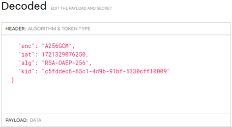

# Encriptación a Nivel de Mensaje

La información sensible será encriptada utilizando JSON Web Encryption (JWE). La encriptación JSON Web representa el contenido encriptado utilizando estructuras de datos basadas en JavaScript Object Notation (JSON). Para obtener especificaciones completas, consulte la especificación de [JWE specification](https://datatracker.ietf.org/doc/html/draft-ietf-jose-json-web-encryption-40).

Para confirmar si las API que desea utilizar admiten encriptación JWE, comuníquese con nuestro equipo de servicios para clientes.

## Generación de Clave Pública

Los emisores generarán un par de claves RSA Pública/Privada utilizando cualquier herramienta de Criptografía y SSL/TLS compatible con OpenSSL.

### Ejemplos de Comandos usando OpenSSL:

1. Generar una clave privada RSA, de tamaño 2048, y guardarla en un archivo llamado key.pem:
   ```
   openssl genrsa -out key.pem 2048
   ```

2. Extraer la clave pública y guardarla en un archivo llamado public.pem:
   ```
   openssl rsa -in key.pem -outform PEM -pubout -out public.pem
   ```

El archivo `public.pem` generado con los comandos anteriores se compartirá con el equipo de implementaciones de API de Fiserv.

## ID de Clave de Encriptación

Fiserv recibirá la clave pública compartida por el emisor y enviará un KID (ID de Clave) a cambio. El KID es un identificador alfanumérico de la clave pública.

El emisor utilizará el KID compartido por Fiserv para identificar la clave privada correspondiente.


### Ejemplo de Estructura JWE que incluye el KID:



## Proceso de Rotación de Claves

El emisor compartirá una nueva clave pública con Fiserv, quien enviará el KID correspondiente.

Durante una ventana de mantenimiento programada, Fiserv marcará el nuevo KID como activo. El emisor recibirá el nuevo KID y recuperará la clave privada correspondiente para la desencriptación. El objetivo principal de utilizar un KID es optimizar el proceso de rotación de claves.

### Ejemplo de Código de Desencriptación

Durante el proyecto de implementación, Fiserv compartirá con el emisor el código de ejemplo para la desencriptación.

---

## Ver también

- [Encriptación a Nivel de Mensaje](?path=docs/spanish/referencia-api/encriptacion.md)
- [Glosario API](?path=docs/spanish/referencia-api/glosario-api.md)
- [Manejo de Respuesta](?path=docs/spanish/referencia-api/manejo-respuesta.md)
- [Respuesta de Error](?path=docs/spanish/referencia-api/respuesta-error.md)
- [Solicitud de API](?path=docs/spanish/referencia-api/solicitud-api.md)
- [Webhook](?path=docs/spanish/referencia-api/4-notificaciones.md)

---
